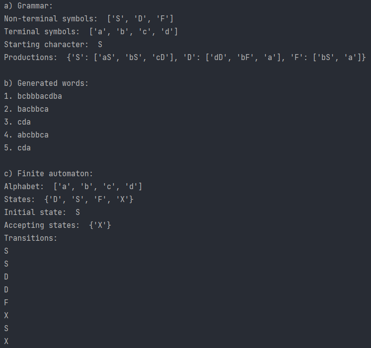
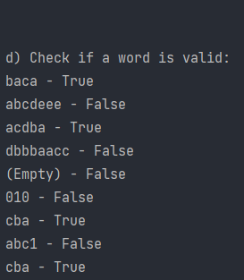

# Laboratory Work Nr.1

### Course: Formal Languages & Finite Automata
### Author: Iatco Sorin
### Variant: 22

----

## Theory
A finite automaton describes a machine which can be in a finite number of states, and can
transition between those states based on input symbols. Finite automata are used to recognize patterns in strings, and 
are commonly used in computer science to build parsers, compilers, and other text processing tools.

A grammar is a set of rules that describe how to generate strings in a language. Grammars are used to define the syntax 
of programming languages, natural languages, and other types of formal languages. A grammar consists of a set of symbols,
known as terminals and non-terminals, as well as a set of production rules that describe how those symbols can be combined
to form strings in the language.

## Objectives:

* Understand what a language is and what it needs to have in order to be considered a formal one.
***  
* Provide the initial setup for the evolving project that I will work on during this semester. Need to do the following:

  * a. Create a local && remote repository of a VCS hosting service;

  * b. Choose a programming language;

  * c. Create a separate folder where to be keeping the report. 
***
* According to my variant number, get the grammar definition and do the following tasks:

  * a. Implement a type/class for my grammar;

  * b. Add one function that would generate 5 valid strings from the language expressed by my given grammar;

  * c. Implement some functionality that would convert and object of type Grammar to one of type Finite Automaton;

  * d. For the Finite Automaton, add a method that checks if an input string can be obtained via the state transition from it;


## Implementation description

* The generateWord function is used to generate a word from the grammar. It calls the generateWordHelper function with the starting symbol, and returns the resulting word.
The generateWordHelper function is a recursive function that takes a character as input and generates a word based on the production rules of the grammar. If the input character 
is a terminal symbol, the function simply returns it. Otherwise, it selects a random production rule for the input character from the productions dictionary, and recursively calls
generateWordHelper on each character in the right-hand side of the production rule. The resulting strings are concatenated together to form the final output word. 

```
    def generateWord(self) -> str:
        return self.generateWordHelper(self.startSymbol)

    def generateWordHelper(self, character: str) -> str:
        if character in self.terminal:
            return character
        rightSide = self.productions[character]
        randomRightSide = random.choice(rightSide)
        word = ''
        for rightChar in randomRightSide:
            word += self.generateWordHelper(rightChar)
        return word
```

* The toFiniteAutomaton function is converting each production rule of the grammar into a transition. 
It creates a set of states, which consists of all non-terminal symbols and a special final state 'X' that is used to represent 
the end of the input. The dimension variable is used to keep track of the number of transitions.
The function then iterates over each non-terminal symbol in the grammar, adds it to the set of states, and extracts its production rules 
from the productions dictionary. For each production rule, the function creates a transition from the non-terminal symbol to the next symbol
in the right-hand side of the rule. If the right-hand side has only one symbol, the next state is set to 'X',
which represents the end of the input. 

```
    def toFiniteAutomaton(self):
        ...
        for nonTerminal in self.nonTerminal:
            dimension += len(self.productions[nonTerminal])
        for nonTerminal in self.nonTerminal:
            states.add(nonTerminal)
            rightHandSides = self.productions[nonTerminal]
            for rightSide in rightHandSides:
                if len(rightSide) > 1:
                    nextState = rightSide[1]
                else:
                    nextState = 'X'
                transitionLabel = rightSide[0]
                transitions.append(Transition(nonTerminal, nextState, transitionLabel))
        ...
```

* The function wordIsValid works by iterating over each character c, and looking for a transition in 
the finite automaton that starts from the current state of the automaton and is labeled with c. If such a transition 
is found, the function updates the current state of the automaton to the next state of the transition, and continues to the next
character. If no such transition is found, the function immediately returns False, indicating that the input string is
not recognized by the finite automaton.
Once all characters in the input string have been processed, the function checks whether the current state of the automaton is an accept state.
If so, the function returns True, indicating that the input string is recognized by the finite automaton. Otherwise, the function returns False.

```
   def wordIsValid(self, word)
        ...
        for c in word:
            foundTransition = False
            for t in self.transitions:
                if t.getCurrentState() == currentState and t.getTransitionLabel() == c:
                    currentState = t.getNextState()
                    foundTransition = True
                    break
            if not foundTransition:
                return False
        ...        
```

## Conclusions / Screenshots

### Conclusion
By carrying out the laboratory work, I have acquired a deeper understanding of formal languages and successfully 
translated a grammar and finite automaton into code. The project enabled me to acquire essential skills such as designing
a grammar class, generating acceptable character strings, and converting objects into finite automata. These skills 
reinforced my comprehension of the fundamental theory. The creation of the conversion method from grammar to a finite 
automaton and the verification of word validity were the most enlightening aspects of the project. They revealed the 
connections between them and how formal languages function as a whole. Furthermore, it laid the groundwork for more 
advanced projects in this field.

### Screenshots


