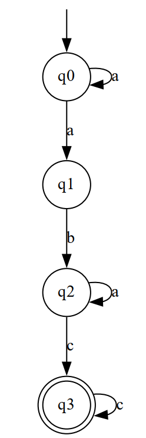

# Laboratory Work Nr.2

### Course: Formal Languages & Finite Automata
### Author: Iatco Sorin
### Variant: 21

----

## Theory
A deterministic finite automaton (DFA) is a type of finite automaton that has a unique transition for each input symbol 
from any given state. In other words, the next state of the DFA is uniquely determined by the current state and the input
symbol. DFAs are often used in computer science and programming to model processes that have a finite number of possible
states, such as parsing strings or recognizing patterns.

A nondeterministic finite automaton (NFA) is a type of finite automaton that may have multiple possible transitions for
a given input symbol from any given state. To convert an NFA to a DFA, we need to find a way to represent all possible
combinations of states that the NFA could be in after processing a given input symbol. This is typically done using a 
subset construction algorithm, which constructs a new DFA from the NFA by representing each combination of states as a 
single state in the DFA.

## Objectives:

* Understand what an automaton is and what it can be used for.
***  
* Continuing the work in the same repository and the same project, the following need to be added:

  * a. Provide a function in your grammar type/class that could classify the grammar based on Chomsky hierarchy.

  * b. For this you can use the variant from the previous lab.

***
* According to my variant number, get the finite automaton definition and do the following tasks:

  * a. Implement conversion of a finite automaton to a regular grammar.

  * b. Determine whether your FA is deterministic or non-deterministic.

  * c. Implement some functionality that would convert an NDFA to a DFA.

  * d. Represent the finite automaton graphically (Optional, and can be considered as a bonus point)


## Implementation description

Made rules for each grammar type on the Chomsky classification. The function starts by checking if the grammar is a
Type 3 grammar by iterating over all non-terminals and productions of the grammar, and checking if each production 
satisfies the conditions of a regular grammar. If the grammar is not Type 3, the function proceeds to check if it is a 
Type 2 grammar by verifying with the precedent steps and so on until the Type 1. If it's not even Type 1, the grammar is
classified as Type 0 and if the grammar don't fit any of the rules, or it's invalid it returns Type None.

```
    ...
        is_type_3 = True
        for nonTerminal in self.nonTerminal:
            for production in self.productions[nonTerminal]:
                if len(production) > 2 or (production[0] not in self.terminal and production[0]
                                           not in self.nonTerminal) or (
                        len(production) == 2 and production[1] not in self.nonTerminal):
                    is_type_3 = False
                    break
        if is_type_3:
            return 'Type 3'
        ...    
```

The function to convert a finite automaton to regular grammar, add new start symbol, non-terminal symbol and add 
rules. Firstly, the function creates a new start symbol S for the regular grammar and adds it to the production rules as a new 
non-terminal symbol. The start symbol S is defined as the start state of the NFA. Secondly, the function creates a new 
non-terminal symbol in the production rules. Next the function adds a production rule to the corresponding non-terminal
symbol in the production rules. The production rule consists of the empty string ε. Next the function adds a production 
rule to the corresponding non-terminal symbol in the production rules. The production rule consists of the input symbol 
and the destination state of the transition. Lastly the function returns a new Grammar object.

```
    ...
    startSymbol = self.startState
        productions[startSymbol] = [self.startState]

        for state in self.states:
            productions[state] = []

        for acceptState in self.acceptStates:
            for state in self.states:
                if acceptState == state:
                    productions[state].append("ε")

        for transition in self.transitions:
            q, a, p = transition
            productions[q].append(a + p)
    ...
```

This function checks if an FA is deterministic or non-deterministic. The function finds all transitions that originate 
from the current state. It extracts the input symbols (labels) associated with those transitions. It then checks if there
are any duplicate input symbols in the list of labels using the set function to remove duplicates. If there are duplicates, 
this means that there are multiple transitions for the same input symbol, indicating that the FA is not deterministic.
If there are no duplicates for any state, the function returns 'Deterministic'. Otherwise, it returns 'Non-Deterministic'.


```
      ...
           for state in self.states:
            transitions = [t for t in self.transitions if t[0] == state]
            labels = [t[1] for t in transitions]
            if len(labels) != len(set(labels)):
                return 'Non-Deterministic'
        ...        
```

The function initializes the variables 'dfa_states, dfa_alphabet, dfa_transitions, dfa_startState' and 'dfa_acceptStates'. 
The 'dfa_states' set will contain the states of the new DFA, 'dfa_alphabet' will be the same as the alphabet of the NFA, 
'dfa_transitions' will contain the transitions of the new DFA, 'dfa_startState' will be the start state of the new DFA, 
and 'dfa_acceptStates' will contain the accept states of the new DFA. The function then initializes a queue with the start
state of the new DFA, which is the epsilon closure of the start state of the NFA. It also initializes a set 'processed_states'
to keep track of the states that have been processed. The function then enters a loop that continues until the queue
is empty. In each iteration, it removes a state 'state_set' from the queue, calculates its epsilon closure, and adds 
it to the DFA states 'dfa_states'. It checks if the current state set contains an accept state from the NFA and adds 
it to the DFA accept states set if necessary. For each symbol in the DFA alphabet, the function calculates the next state
'next_states' by moving from the current state set on that symbol, and takes the epsilon closure of the resulting set. 
If the resulting set is not empty, it adds the transition (state_set, symbol, frozenset(next_states)) to the DFA transitions 
'dfa_transitions'. It also adds the resulting set to the queue if it has not already been processed.
Finally, the function creates a new DFA object using the variables 'dfa_states, dfa_alphabet, dfa_transitions, dfa_startState'
and 'dfa_acceptStates' and returns it.

```
        ...
        while queue:
            state_set = queue.pop(0)
            if state_set in processed_states:
                continue
            processed_states.add(state_set)

            # Add the current state set to the DFA states
            dfa_states.add(state_set)

            # Check if the current state set contains an accept state from the NDFA
            for accept_state in self.acceptStates:
                if accept_state in state_set:
                    dfa_acceptStates.add(state_set)
                    break

            # Calculate transitions for the current state set
            for symbol in dfa_alphabet:
                next_states = self.epsilon_closure(self.move(state_set, symbol, self.transitions), self.transitions)
                if len(next_states) > 0:
                    dfa_transitions.append((state_set, symbol, frozenset(next_states)))
                    if frozenset(next_states) not in processed_states:
                        queue.append(frozenset(next_states))
        ...
```

## Conclusions / Results

### Conclusion
This laboratory work explored different concepts related to formal languages and automata. I implemented a function to
classify a grammar based on the Chomsky hierarchy, a conversion of a finite automaton to a regular grammar, and a 
determination of whether the FA is deterministic or non-deterministic. I also implemented functionality to convert an 
NDFA to a DFA, which is important because DFAs are easier to work with than NFAs and can be used to manipulate and 
analyze the language generated by the automaton. Additionally, the laboratory work provided practical experience in 
working with grammars and automata, and I learned how to represent the automaton graphically, which can be useful in many
applications.

### Results
2a) Grammar Type: 
 Type 3

3a) Regular Grammar converted from FA:

Finite automaton:

Alphabet:  ['a', 'b', 'c']

States:  {'q3', 'q2', 'q1', 'q0'}

Initial state:  q0

Accepting states:  {'q3'}

Transitions:  [('q0', 'a', 'q0'), ('q0', 'a', 'q1'), ('q1', 'b', 'q2'), ('q2', 'c', 'q3'), ('q3', 'c', 'q3'), ('q2', 'a', 'q2')]

Regular Grammar:

NonTerminal symbols:  ['q3', 'q2', 'q1', 'q0']

Terminal symbols:  ['a', 'b', 'c']

Starting character:  q0

Productions:  {'q0': ['aq0', 'aq1'], 'q3': ['ε', 'cq3'], 'q2': ['cq3', 'aq2'], 'q1': ['bq2']}

Some generated words by the grammar converted from the FA: 
abc 

abaac 

aaaabaac

3b) Determine is my FA deterministic: 
 Non-Deterministic

3c) Converted DFA: 

Alphabet:  ['a', 'b', 'c']

States:  {frozenset({'q0'}), frozenset({'q3'}), frozenset({'q2'}), frozenset({'q1', 'q0'})}

Initial state:  frozenset({'q0'})

Accepting states:  {frozenset({'q3'})}

Transitions:  [(frozenset({'q0'}), 'a', frozenset({'q1', 'q0'})), (frozenset({'q1', 'q0'}), 'a', frozenset({'q1', 'q0'})), (frozenset({'q1', 'q0'}), 'b', frozenset({'q2'})), (frozenset({'q2'}), 'a', frozenset({'q2'})), (frozenset({'q2'}), 'c', frozenset({'q3'})), (frozenset({'q3'}), 'c', frozenset({'q3'}))]

Determine if converted DFA is true: 
 Deterministic

3d) The finite automaton graphically:



## References
https://github.com/DrVasile/FLFA-Labs/blob/master/2_FiniteAutomata/task.md  